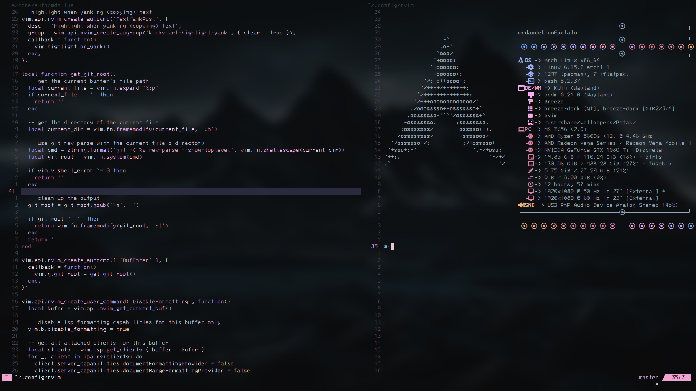

# six.nvim 

Welcome to my custom configuration for Neovim. This configuration was originally forked from **kickstart.nvim** but has been greatly changed.



## Setup
You will generally need the following dependencies installed and on PATH:
- curl
- unzip
- python
- python-pip
- nodejs
- npm
- ripgrep

For more **specific set up instructions** depending on your OS and distribution , see the guides inside `doc/`:
- [Ubuntu/Debian](doc/ubuntu_setup.md)
- [Windows](doc/windows_setup.md)
- [Arch](doc/arch_setup.md)

## Key Features
This is an all purpose configuration with a focus on coding in many different programming languages. Below is an overview of some key features of my config. I plan on making separate plugins for all of these eventually.

<a id="colemak-swappable"></a>
### Colemak-DH / QWERTY Swappable
I code primarily using Colemak-DH on ZSA's Moonlander keyboard (check out my [keyboard config](https://github.com/mrdandelion6/ViMak-Moonlander)) , and when I have to use a regular staggered keyboard I use QWERTY. For this reason , I made a user command: *ToggleColemak* , which lets you swap between different key layouts instantly. You can find it in `lua/core/keymaps.lua`. You can also press `<leader>tc` to trigger it.

Going into Colemak-DH layout swaps your movement keys from **hjkl to knei**. This include buffer jumping , telescope , and everything else I could remember where movement is involved. Here is a list of keys swapped:
```bash
# pressing the left key (in []) triggers the action for key on the right
['k'] = 'h',
['n'] = 'j',
['e'] = 'k',
['i'] = 'l',

['K'] = 'H',
['N'] = 'J',
['E'] = 'K',
['I'] = 'L',

# notice, these are not symmetrical to above
['h'] = 'n',
['j'] = 'e',
['l'] = 'i',

['H'] = 'N',
['J'] = 'E',
['L'] = 'I',
```
These remaps affect key sequences as well. See [keymaps.lua](lua/core/keymaps.lua) for more detail.

### Local Settings & Learn-to-Code Notes
You will find a file `.localsettings_template.json` in the root of this repo. Upon running `nvim` for the first time with this configuration , a file `.localsettings.json` will be generated. This file allows for persistent local settings that won't push to the repo. For example , when you toggle to Colemak-DH from QWERTY , your next `nvim` session will remember that you are currently on Colemak.

You can also edit the **"notes_path"** JSON key to point to the path of any text notes you want to frequently look at. For instance , I have a big repo of all my various coding notes: [Learn-to-Code](https://github.com/mrdandelion6/Learn-to-Code). Pressing `<leader>fn` opens a telescope that will search through my notes repo. I find myself using this very often , if I ever forget anything and want a quick `man` like seach , or if I want to jot something new down. Feel free to clone my Learn-to-Code repo and use it.

If you want to exclude particular file name patterns from being autoformated by `nvim` when saving buffers , then you can also add patterns in the **"exclude_autoformat"** JSON key.

### Cursor Always Centered
The cursor is always kept centered , even at the end of a file. Normally , even with `scrolloff = 999` , Neovim uncenters the cursor at the end of the file. This is very annoying if your coding at the end of a file and have to constantly look down at the bottom edge of your screen. To get around this I made an autocommand that keeps the cursor fixed at the center , even at EOF. Will make this into a standalone plugin soon.

<a id="terminal-title"></a>
### Terminal Buffers Keep Title as PWD
There is only one global status line instead of one per buffer. This is to keep things compact. The global status line displays the git root directory name of file in the current buffer (blank if not a repository). In return, each buffer gets its own small title at the top to indicate file name. For terminal buffers , this header corresponds to the PWD of the terminal.

This is done through modifying `.bashrc` to send a signal to Neovim whenever you change directory or start a shell. You must copy some of the contents of `bashrc.sh` into your own `~/.bashrc` script for this to work. I have not yet implemented a Windows equivalent feature :(

### Runnable Jupyter Notebooks
An unstable feature I am working on. Currently the plugin files for this end in the suffix `.unstable`. I didn't make a separate branch for this because I follow bad practices sometimes , sorry.

When complete , should be able to view Jupyter notebooks like they are markdown files with runnable segments of code.

### LaTeX Compilation
You can type and compile LaTeX locally through Neovim instead of using Overleaf. This is mostly handled my the `lervag/vimtex` plugin. You will need to install the following dependencies:
- pdflatex
- Zathura for linux
- SumatraPDF for Windows

If you want to use other compilers such as `xelatex` , create a `.latexmkrc` file in the same directory as the `.tex` file and specify the following:
```bash
$pdf_mode = 5; # uses xelatex
$postscript_mode = 0;
$dvi_mode = 0;
```
Here are what the different values for `pdf_mode` change for the compilation process:
- 1: uses `pdflatex` engine
- 2: uses `latex` + `dvips` + `ps2pdf` (requires `$postscript_mode = 1`)
- 3: uses `latex` + `dvipdf` (or `dvipdfm`/`dvipdfmx`, requires `$dvi_mode = 1`)
- 4: uses `lualatex` engine
- 5: uses `xelatex` engine

If no `.latexmkrc` file is found , falls back to `pdflatex`. Note that `pdflatex` , `xelatex` , and `lualatex` require `postscript_mode` and `dvi_mode` to be set to zero.

Hot reloading should be enabled by default for either Zathura or SumatraPDF (this config decides which to use depending on whether you're using Linux or Windows). Every time you write the file `:w` , Neovim will automatically invoke the compilation for whatever `pdf_mode` you have set and update the PDF.

## Files
You can find a breakdown of my files and what they are used for in [doc/files.md](doc/files.md).

## Terminal & Background
I use Wezterm for my terminal , in which I run Neovim as I develop on both Linux and Windows. You can find my configuration for Wezterm on Arch in my [.dotfiles repo](https://github.com/mrdandelion6/.dotfiles) , and for Windows in [.winfiles repo](https://github.com/mrdandelion6/.winfiles).

The background image I use for my terminal can be found [here](). And the different ASCII art I use can be found [here]().

## TODO
Here is a list of featues I plan on implementing.

### Visual
- On the right side of buffers , add symbol to indicate where errors are in file (relative to size).
- Fix bug with cursor not centering based on height. Right now , cursor centers based on 'lines above' which is skewed for lines that bleed to the next row. Make this into its own plugin later.
- Make bottom right status box transparent and change the color of text inside it to pink.
- Add terminal top bar updates for PowerShell users.

### Color Scheme
- Make class definitions light orange.
- Make constructor/destructor definition and calls same color as functions (light pink).
- Make class type light orange or keep it as light red depending on definition and constructor/destructor colors.
- Make (*) same color as string when it's for pointer.
- Make (&) same color as string when it's for address.
- Make header name color different than regular string color if possible. Make it grey or light red.

### Plugins
- Fix Telescope bug with `ripgrep` not finding empty textfiles.

### Add LSP
- CUDA
- x86
- LaTeX
- PowerShell
- Java
- Rust
- Verilog
- Swift : Mason currently throwing an error when using `bash/swift_sourcekit_lsp.sh` in `lua/plugins/lsp.lua`.

### Long Term
Not going to do these anytime soon.
- Make Jupyter notebooks work using the plugins currently suffixed with `.unstable` in lua/plugins.

### Other Bugs/Featues
- Get_git_root() causes lag on Windows whenever it runs so set up a cache table for filepaths so it is only called once on files. Also set it to only be called when we are viewing a text file in the buffer (no terminal).

## Latest Changes
### v1.2
- **LaTeX compilation support**: Added LaTeX support with automatic compilation and hot reloading using `vimtex` plugin
- **Git root caching**: Now caching Git root directory paths to reduce calls for `git -C %s rev-parse --show-toplevel` as this caused lag issues on Windows devices

### v1.1
- **Terminal title updates**: Resolved plugin loading order issue that prevented terminal titles from updating properly
- **Discord presence**: Added Discord presence using `presence.nvim`

### v1.0
- **Renamed to six.nvim**: Updated branding and reached version 1.0 milestone
- Cursor automatically centers when text changes (undo, edits, etc.) for better focus now
- Fixed EOF cursor positioning bug and improved save behavior with cursor centering
- **Added documentation**: Added Windows setup guide alongside existing Arch and Ubuntu documentation

Reach out to me with any questions. Happy coding.
